<h1 align="center"><i>3D GAME EXAMPLE (JUST SCRIPTS) UNITY SPECIALISATION TRAINING</i></h1>

In this project of mine, I combined the Unity specialization training I received from the Game and Application Academy with my own work. However, due to file size constraints, I only uploaded script files for the project. The training we received covered not only script files but also various aspects of Unity, and I will share photos of those.

Training Contents and Projects I Have Completed:

Introduction to 3D Game Design

Environmental Design

Importing, Materials, Lights

Render Pipelines

Character Animator, Character Animator-2

Cinemachine

Level Design Assets

Collecting Rewards

NPC

User Interfaces

Object Animations

Working with Scenes

Adding Short Films to the Game

Particle System

VFX Graph

Shadergraph

Optimization for Mobile

Advertising and Dashboard

Multiplayer

   

      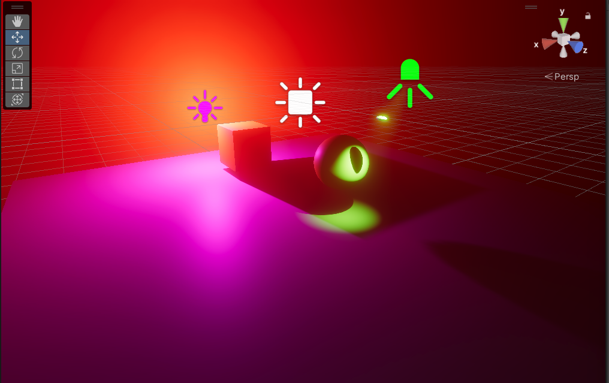
      
      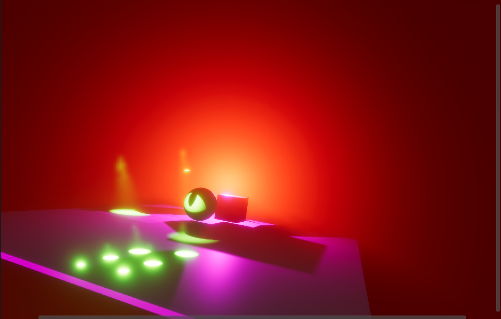
      
      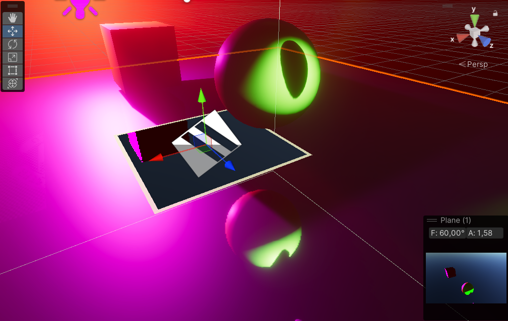
      
      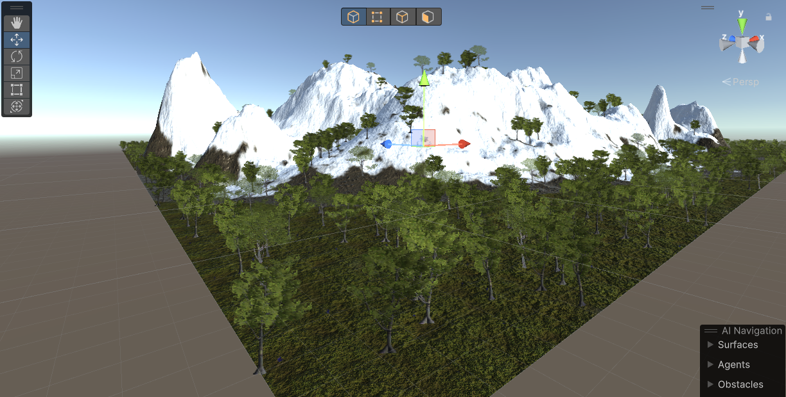
      
      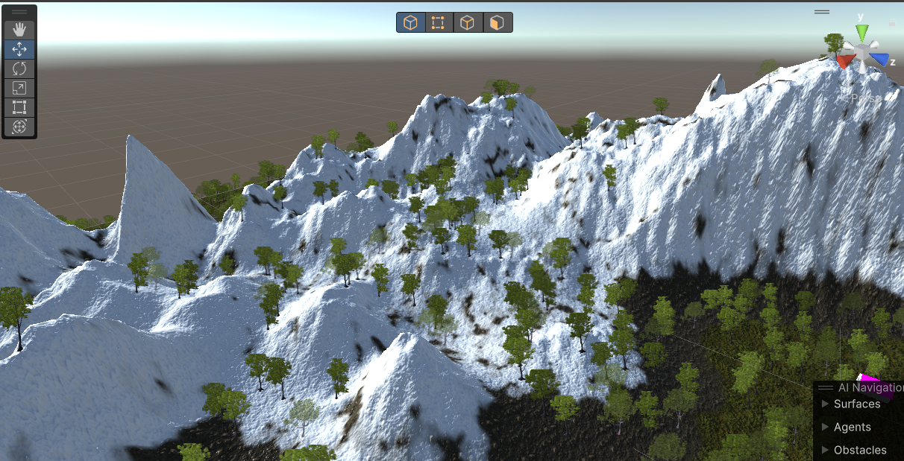
      
      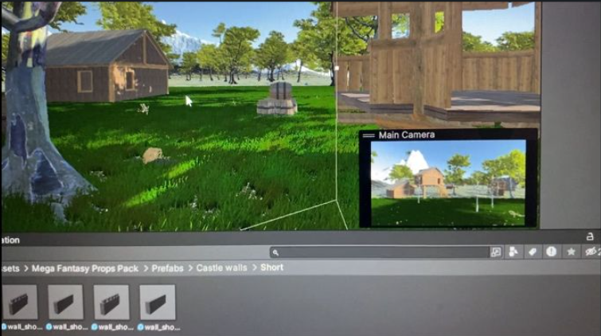
      
      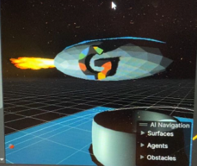
      
      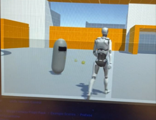
      
      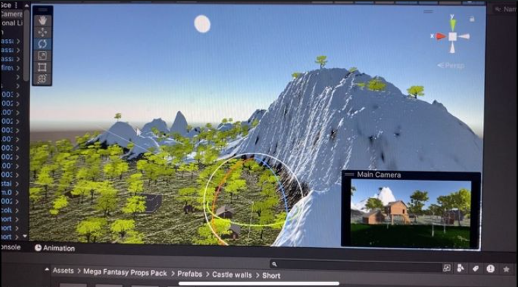
      
      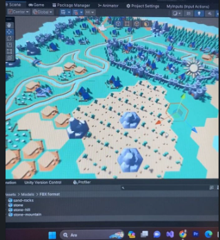
      
      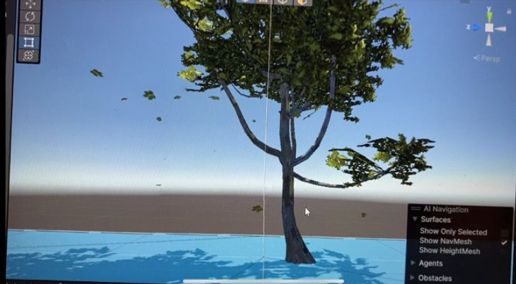
      
      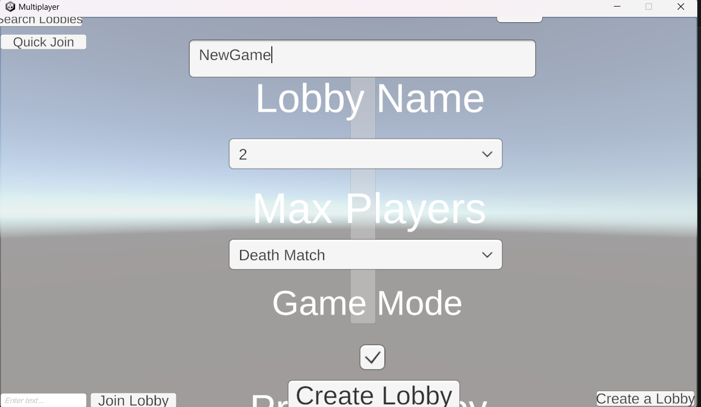
      
      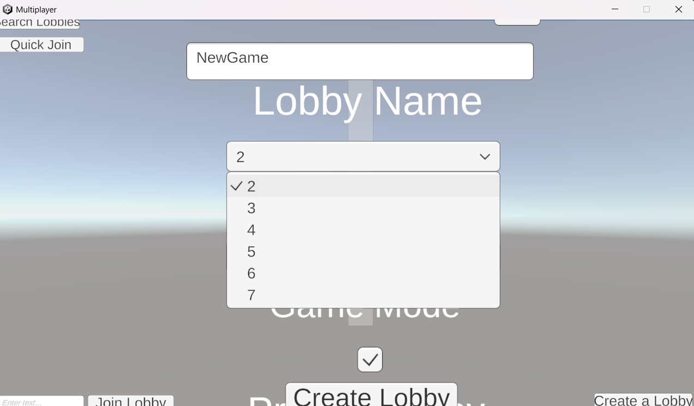
      
      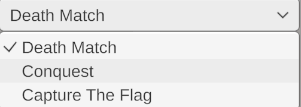
      
      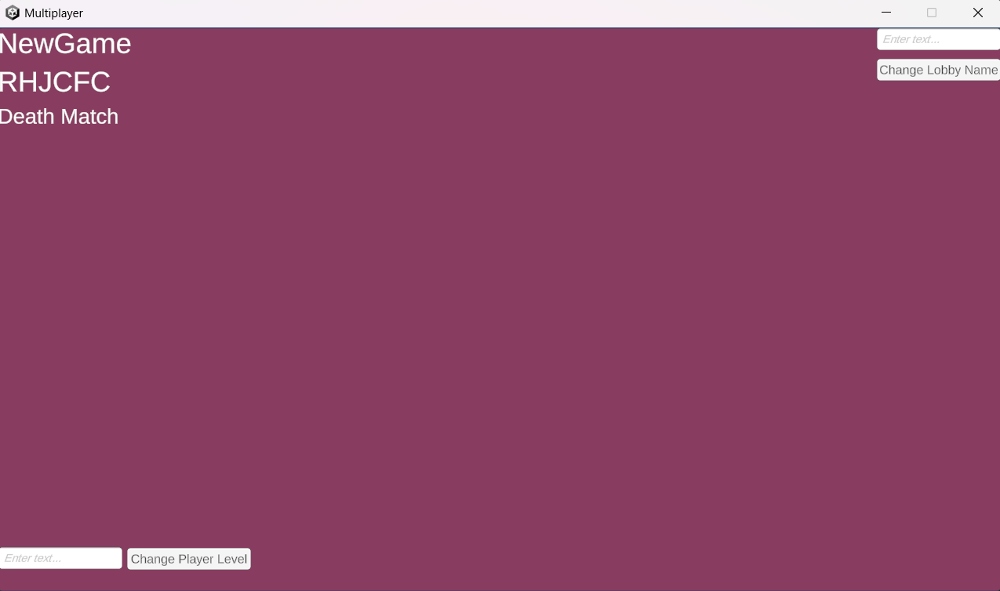
      
      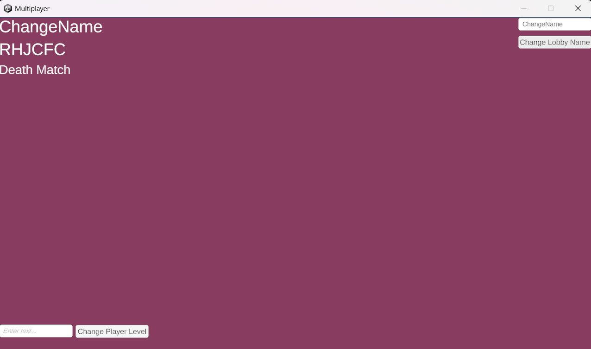
   

